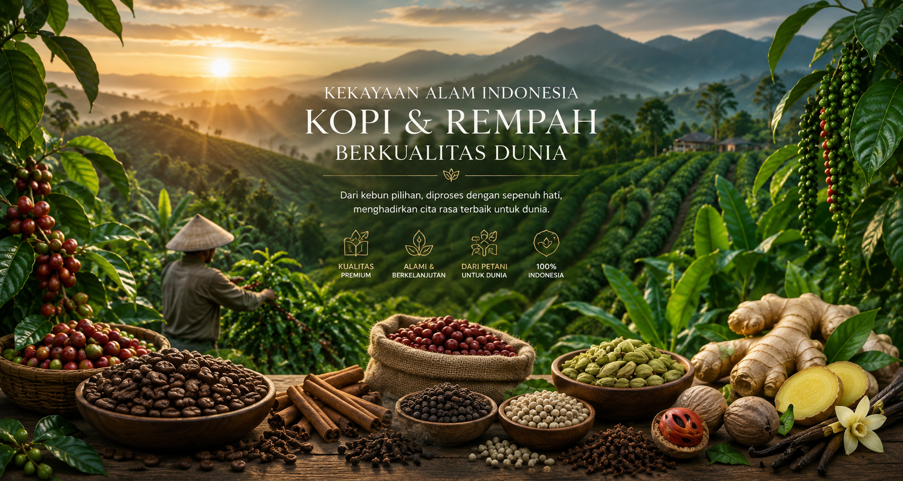
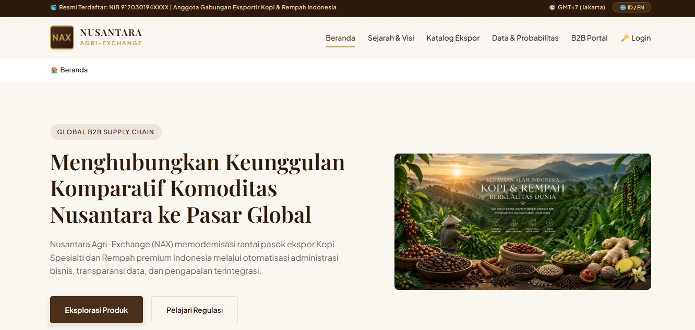
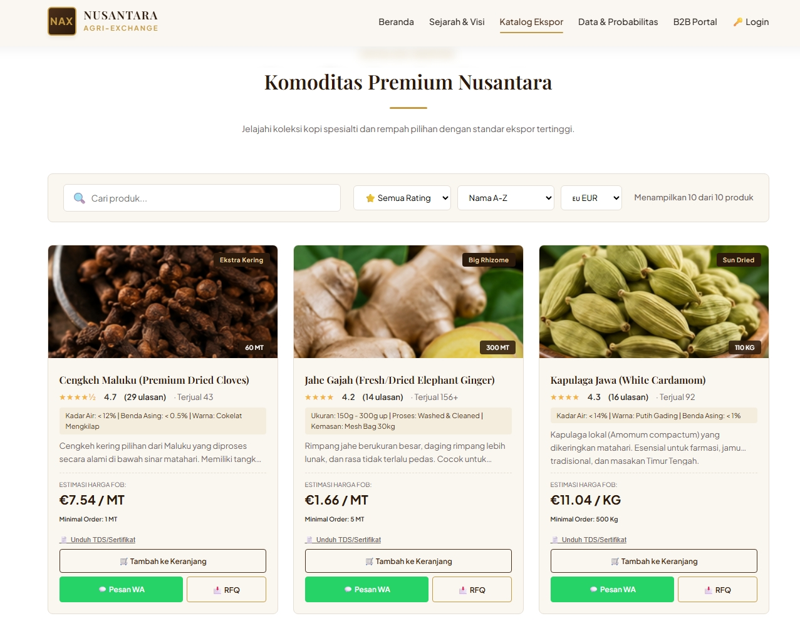
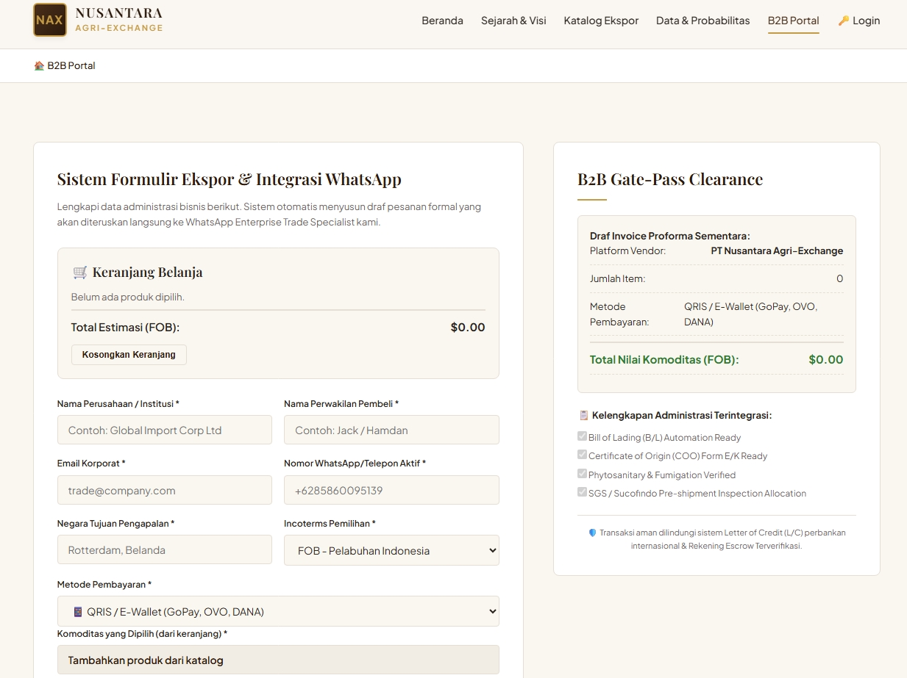
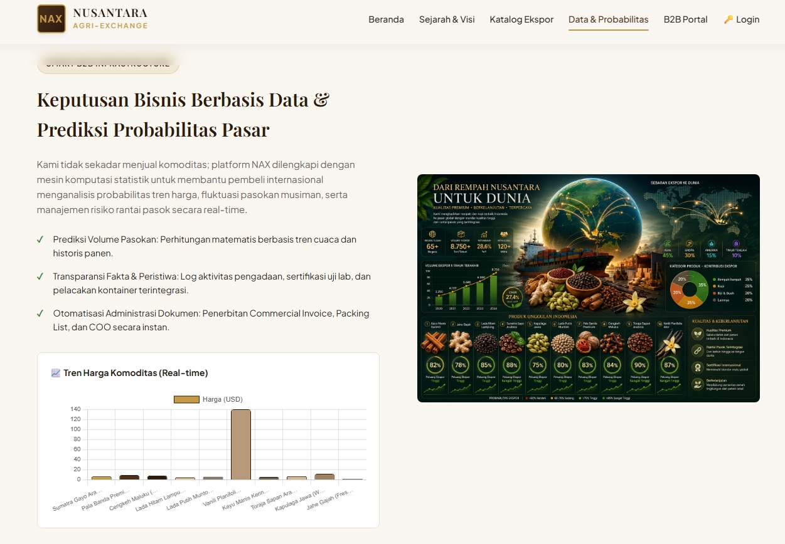
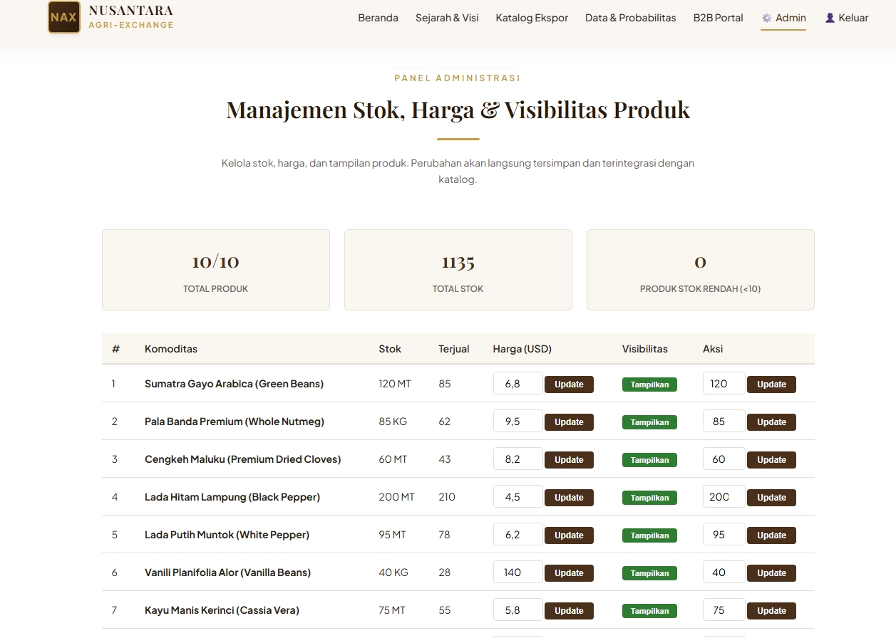

# ☕ Nusantara Agri-Exchange (NAX) - B2B E-Commerce
**Tugas Project Ujian Akhir Semester (UAS) - Mata Kuliah KAIT II (E-Commerce/HTML)**



---

## 👨‍🎓 Informasi Mahasiswa
* **Nama:** Hamdan Yuwavi
* **NIM:** 209250011
* **Program Studi:** Administrasi Bisnis
* **Kelas:** Abi 1/2025
* **Universitas:** International Women University
* **Dosen Pengampu:** Yoki Oktorian Sukardi S.Kom., M.A.B.

---

## 🚀 Deskripsi Proyek
**Nusantara Agri-Exchange (NAX)** adalah sebuah prototipe platform e-commerce *Business-to-Business* (B2B) yang dirancang untuk memodernisasi rantai pasok ekspor komoditas unggulan Indonesia, khususnya Kopi Spesialti dan Rempah Premium. 

🌐 **Live Website (GitHub Pages):** [https://hamdanyuwavi04-dotcom.github.io/Final_Project/]

---

## 📸 Screenshot Tampilan (UI/UX)
Berikut adalah antarmuka website yang responsif di berbagai perangkat (Desktop & Mobile):

### 1. Halaman Beranda (Hero Section)


### 2. Katalog Produk & Filter


### 3. Halaman B2B Checkout & Simulasi PO


### 4. Dashboard Analitik (Chart.js)


### 5. Panel Admin (Client-side)


---

## 🎥 Video Demonstrasi
Untuk melihat bagaimana seluruh fitur (Add to Cart, RFQ, Ganti Bahasa, dan Panel Admin) berfungsi secara *real-time*, silakan tonton video demo singkat berikut:

### 🎥 Video Demonstrasi NAX
[](https://www.youtube.com/watch?v=PFAbVMvqtvI)

---

## 💼 Dokumentasi Bisnis & Strategi E-Commerce

### 1. Landasan Teori Perdagangan Internasional
Proyek ini mengadopsi **konsep dasar bisnis internasional** dengan memfasilitasi mode *Direct Exporting* (Ekspor Langsung). Dengan berfokus pada kopi dan rempah, platform ini mengkomersialkan komoditas yang menjadi keunggulan komparatif (*comparative advantage*) Indonesia di pasar global, menghilangkan asimetri informasi antara eksportir lokal dan importir asing.

### 2. Target Market & Segmentasi Pelanggan
* **Segmentasi Geografis:** Pembeli internasional (pasar Eropa, Amerika, dan Timur Tengah).
* **Segmentasi Demografis/Firmografis:** Pabrik *roastery* kopi skala menengah-besar, pabrik ekstraksi, industri *F&B*, dan distributor global.
* **Karakteristik:** Membutuhkan pasokan dalam volume besar (Metrik Ton) dan menuntut sertifikasi kualitas (ISO, Organik).

### 3. Analisis Pasar & Kompetitor
* **Masalah (Pain Points):** Panjangnya rantai perantara (tengkulak) dan inefisiensi birokrasi perdagangan internasional.
* **Keunggulan Kompetitif NAX:** Memotong rantai perantara langsung ke koperasi petani, menyediakan transparansi data harga (*real-time chart*), dan form *Request for Quotation* (RFQ) terintegrasi WhatsApp.

### 4. Model Bisnis, Harga & Promosi
* **Model Bisnis:** B2B *Marketplace & Direct Export Aggregator*.
* **Strategi Harga (Pricing Strategy):** *Value-based pricing* dengan tampilan estimasi harga USD. Dilengkapi diskon otomatis (bulk-pricing) sebesar 5% untuk pesanan di atas 5 Metrik Ton.
* **Promosi:** Optimalisasi konversi melalui antarmuka dwibahasa (Indonesia/Inggris) untuk membangun kepercayaan *buyer* asing.

### 5. Proses Checkout & Simulasi Payment Gateway
Proses *checkout* dirancang khusus untuk alur operasional B2B:
* Pengguna mengisi form administrasi ekspor wajib (Incoterms, Negara Tujuan).
* Sistem meng- *generate* draf *Proforma Invoice* secara otomatis.
* **Payment Simulasi:** Tersedia opsi *Letter of Credit (L/C)*, *Telegraphic Transfer (T/T)*, dan *Escrow Service*.

---

## 💻 Technical & Deployment Documentation

### 🛠️ Tech Stack yang Digunakan (Pure Vanilla)
* **HTML5:** Struktur semantik.
* **CSS3:** Penggunaan *CSS Variables*, *Flexbox*, *CSS Grid*, dan *Custom Modals/Toasts*.
* **Vanilla JavaScript (ES6):** Manipulasi DOM, validasi *form*, *Local Storage* (menyimpan data *cart* & stok admin), perhitungan dinamis, dan i18n (*multi-language*).
* **Chart.js:** *Library* untuk visualisasi grafik komoditas (Probabilitas Pasar).

### 📱 Responsiveness (Cross-Device Compatibility)
Menggunakan pendekatan *Mobile-First & Media Queries* (992px, 768px, 480px) untuk memastikan layout grid produk, tabel admin, dan form checkout beradaptasi sempurna di berbagai ukuran layar tanpa *overflow*.

### ⚙️ Instruksi Pengujian Khusus (Panel Admin)
Sistem ini dilengkapi *dashboard* admin untuk memanipulasi stok dan harga.
1. Klik menu **🔑 Login** di navigasi.
2. Pilih peran **Admin**.
3. Masukkan kode sandi: `Nax2026`.
4. Anda sekarang dapat mengakses menu **⚙️ Admin** untuk mengatur visibilitas dan stok katalog secara *real-time*.

### 📂 Struktur Folder
```text
📦 nax-b2b-ecommerce
 ┣ 📂 images/         # (Aset gambar banner, produk, logo)
 ┣ 📜 index.html      # (Struktur utama halaman)
 ┣ 📜 style.css       # (Desain, layout, dan media queries)
 ┣ 📜 script.js       # (Logika keranjang, admin, i18n, dll)
 ┗ 📜 README.md       # (Dokumentasi proyek)
